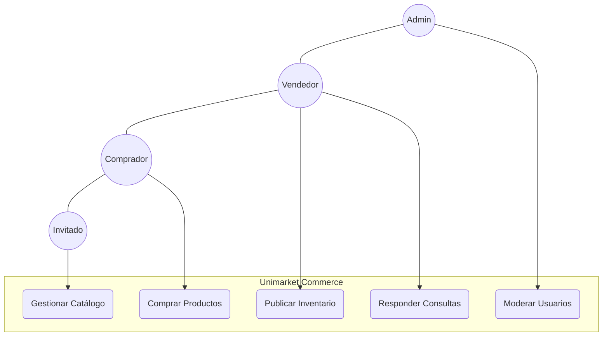
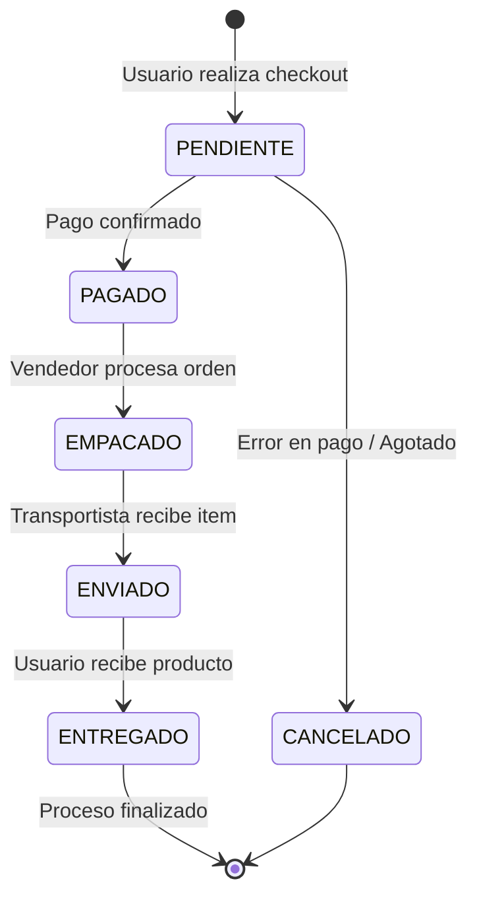
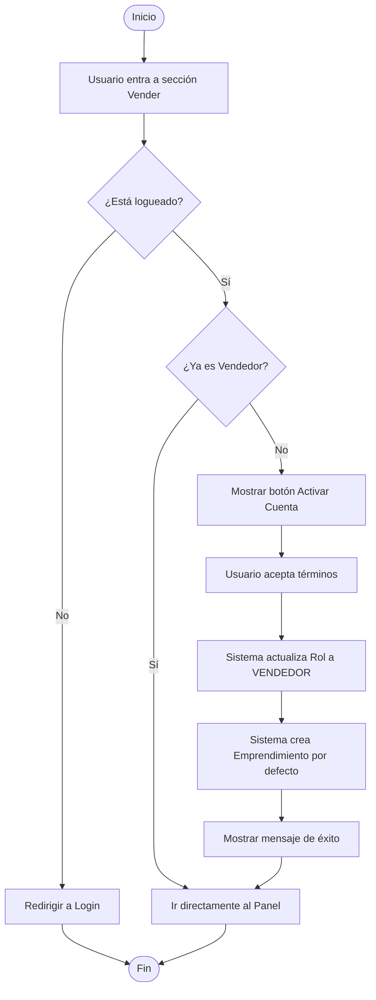
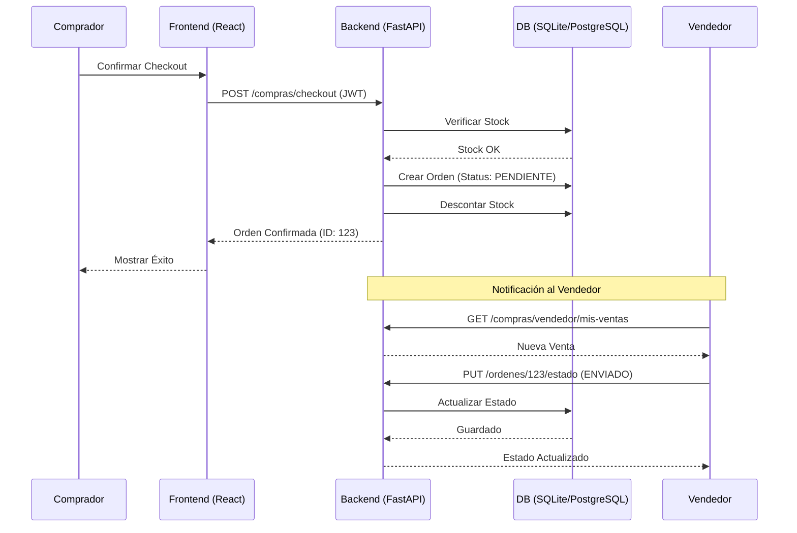
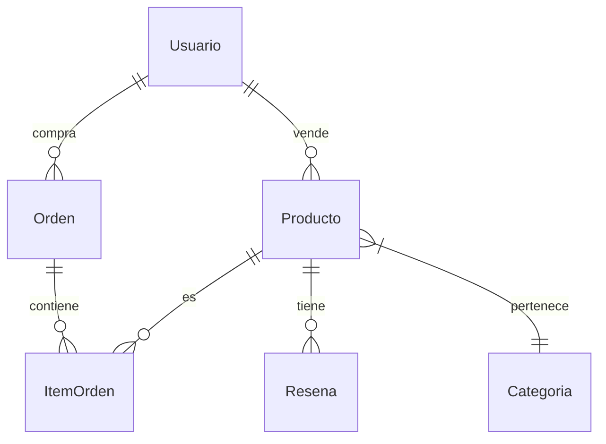

# 🛒 UNIMARKET - Documentación Técnica Avanzada

Bienvenido a la documentación oficial de **Unimarket**. Este documento está diseñado para arquitectos de software, desarrolladores y revisores que deseen entender la lógica interna, el flujo de datos y la infraestructura del sistema.

---

## 🧭 Tabla de Contenido

1. [Vision General](#vision-general)
2. [Diagramas UML](#diagramas-uml)
3. [Arquitectura de Software](#arquitectura-de-software)
4. [Seguridad y Autenticacion](#seguridad-y-autenticacion)
5. [Estructura del Proyecto](#estructura-del-proyecto)
6. [Guia rapida de API](#guia-rapida-de-api)
7. [Hoja de Ruta](#hoja-de-ruta)

---

## Vision General

Unimarket es una solución de E-commerce Multi-vendedor (Marketplace) robusta, escalable y con una experiencia de usuario (UX) inspirada en los líderes de la industria.

- **Actores principales**: Compradores, Vendedores, Administradores.
- **Diferenciador**: Sistema integrado de Preguntas/Respuestas y Gestión de Reputación por reseñas verificadas.

---

## Diagramas UML

### 🎭 Casos de Uso



### 📶 Diagrama de Estados (Ciclo de Vida de la Orden)

Este diagrama es crucial para entender cómo fluye una compra a través del sistema.



### 🏃 Diagrama de Actividad: Proceso de Activación de Vendedor

Muestra la lógica de decisión para que un usuario común se convierta en vendedor.



### 🔁 Diagrama de Secuencia: Proceso de Compra y Venta

Este diagrama muestra la interacción entre componentes durante una transacción exitosa.



---

## Arquitectura de Software

### Capas del Sistema

El sistema sigue un patrón de **Arquitectura en Capas** para asegurar el desacoplamiento:

1. **Capa de Presentación (React)**: Componentes atómicos, gestión de estado con Context API.
2. **Capa de Aplicación (FastAPI Routers)**: Orquestación de lógica de negocio y validación de esquemas (Pydantic).
3. **Capa de Persistencia (SQLAlchemy)**: Mapeo objeto-relacional (ORM) y gestión de sesiones.

### 💾 Modelo de Datos (ERD)



---

## Seguridad y Autenticacion

Unimarket utiliza **JWT (JSON Web Tokens)** para una autenticación sin estado (Stateless).

- **Registro**: Las contraseñas se encriptan con **BCrypt** (Salt de 12 rondas).
- **Autorización**: Middleware basado en roles (`Depends(obtener_usuario_vendedor)`).
- **Flujo de Token**:
    1. Usuario envía credenciales.
    2. Backend valida y firma un token con expiración de 30-60 min.
    3. Frontend guarda en `localStorage` o `cookies`.
    4. Frontend incluye `Authorization: Bearer <token>` en cada request.

---

## Estructura del Proyecto

```text
unimarket/
├── backend/                # Lógica del Servidor (FastAPI)
│   ├── routers/            # Endpoints segmentados por dominio
│   ├── auth.py             # Seguridad y JWT
│   ├── models.py           # Modelos de Base de Datos
│   ├── schemas.py          # Validaciones Pydantic
│   └── main.py             # Punto de entrada
├── frontend/               # Aplicación de Cliente (React)
│   ├── src/
│   │   ├── components/     # UI Reutilizable
│   │   ├── context/        # Estado Global (Auth)
│   │   ├── pages/          # Páginas de la SPA
│   │   └── utils/          # Formateadores y Ayudas
├── DOCUMENTACION.md        # Este archivo
└── requirements.txt        # Dependencias
```

---

## Guia rapida de API

Para más detalles, visita `/docs` en el servidor local.

| Método | Endpoint | Descripción | Privacidad |
| :--- | :--- | :--- | :--- |
| `POST` | `/auth/registro` | Crea un nuevo usuario | Público |
| `GET` | `/productos` | Lista catálogo con filtros | Público |
| `POST` | `/compras/checkout` | Procesa una compra | Usuario |
| `PUT` | `/vendedor/productos` | Gestiona inventario | Vendedor |

---

## Hoja de Ruta

### Fase 1: Consolidación (Completado ✅)

- [x] CRUD de Productos.
- [x] Checkout y gestión de stock.
- [x] Perfil de vendedor y tienda.
- [x] Implementación de Caché con **Redis** para búsquedas rápidas.

### Fase 2: Escalabilidad (Próximamente 🚀)

- [ ] Implementar **Websockets** para chat en tiempo real entre comprador y vendedor.
- [ ] Integración real con pasarelas de pago (Stripe/Mercado Pago).
- [ ] Subida de imágenes a **AWS S3** o Cloudinary.

---

> **Nota para Desarrolladores:** Asegúrese de configurar el archivo `.env` en el backend con una `SECRET_KEY` robusta antes de pasar a producción.
