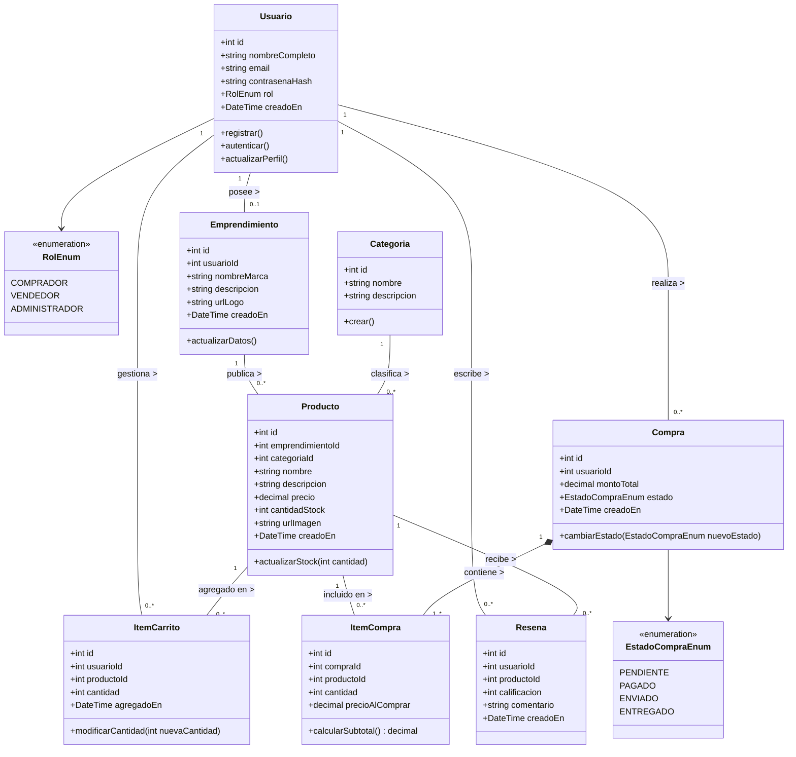
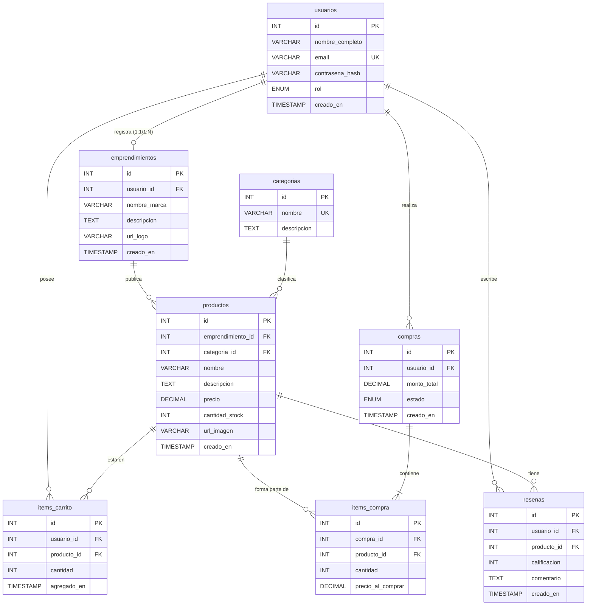
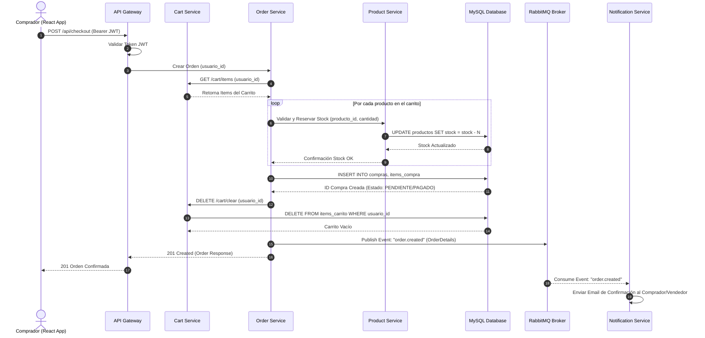
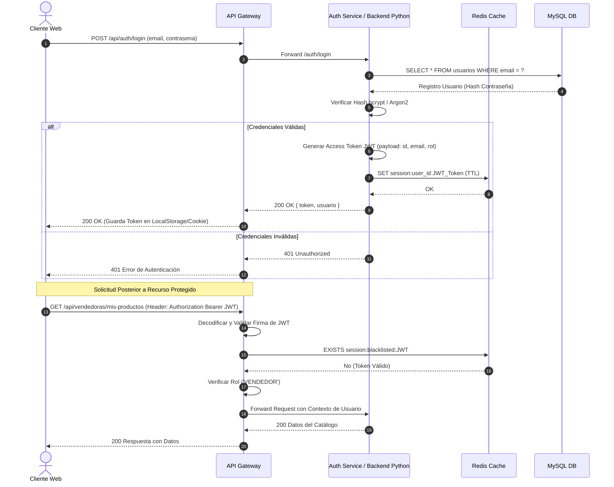
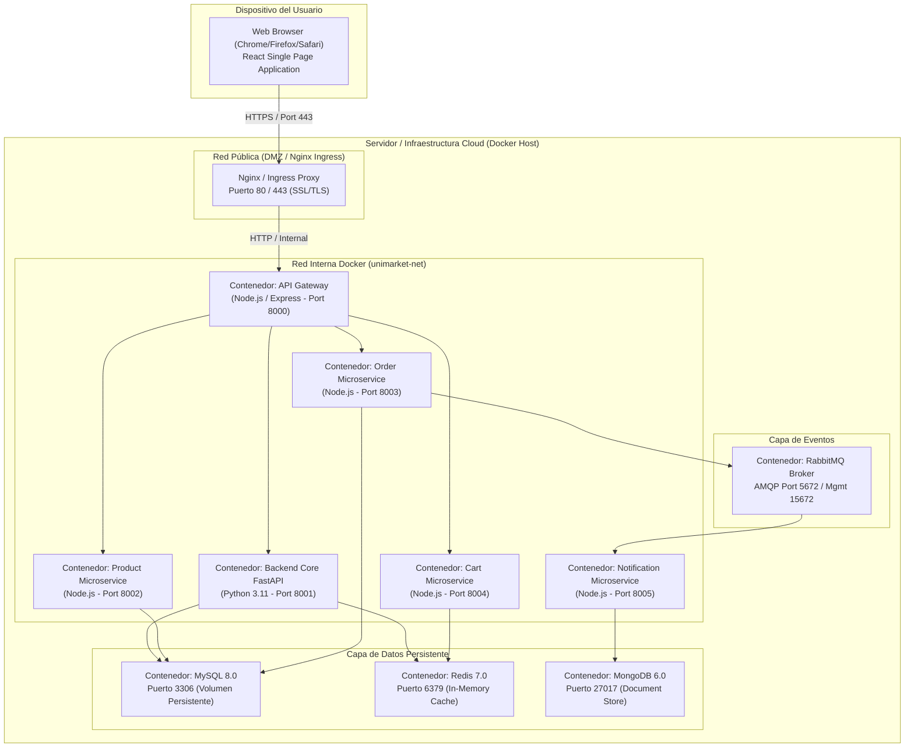
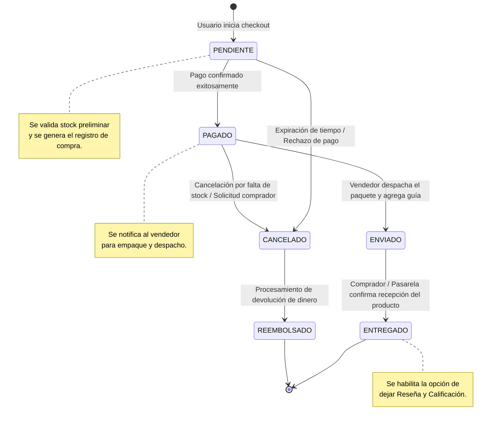
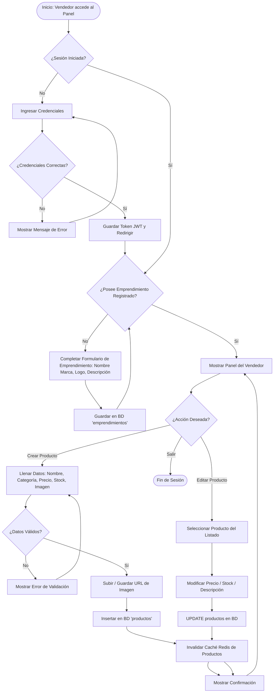

# Documentación de Arquitectura y Diagramas UML - UNIMARKET

Este documento contiene la especificación de la arquitectura de **UNIMARKET** (Plataforma e-commerce para emprendimientos universitarios / SENA) mediante **9 diagramas UML distintos**, expresados en sintaxis nativa de **Mermaid**.

---

## Índice de Diagramas UML

1. [Diagrama de Casos de Uso (Use Case Diagram)](#1-diagrama-de-casos-de-uso)
2. [Diagrama de Clases del Dominio (Class Diagram)](#2-diagrama-de-clases-del-dominio)
3. [Diagrama Entidad-Relación (ER Diagram / Modelo de Datos)](#3-diagrama-entidad-relación)
4. [Diagrama de Secuencia: Procesamiento de Compra y Checkout](#4-diagrama-de-secuencia-procesamiento-de-compra-y-checkout)
5. [Diagrama de Secuencia: Autenticación y Autorización JWT](#5-diagrama-de-secuencia-autenticación-y-autorización-jwt)
6. [Diagrama de Componentes del Sistema (Component Diagram)](#6-diagrama-de-componentes-del-sistema)
7. [Diagrama de Despliegue de Infraestructura (Deployment Diagram)](#7-diagrama-de-despliegue-de-infraestructura)
8. [Diagrama de Máquina de Estados: Ciclo de Vida de una Orden](#8-diagrama-de-máquina-de-estados-ciclo-de-vida-de-una-orden)
9. [Diagrama de Actividades: Gestión de Productos por Vendedor](#9-diagrama-de-actividades-gestión-de-productos-por-vendedor)

---

## 1. Diagrama de Casos de Uso

Muestra las interacciones clave entre los actores del sistema (**Comprador**, **Vendedor**, **Administrador** y **Sistema de Notificaciones**) y las funcionalidades principales ofrecidas por UNIMARKET.

```mermaid
graph TD
    %% Actores
    Comprador((":bust_in_silhouette: Comprador"))
    Vendedor((":briefcase: Vendedor"))
    Admin((":shield: Administrador"))
    NotifSys((":bell: Sistema Notificaciones"))

    subgraph UNIMARKET ["Plataforma UNIMARKET"]
        UC1["Registrarse / Iniciar Sesión"]
        UC2["Explorar / Buscar Productos"]
        UC3["Gestionar Carrito de Compras"]
        UC4["Realizar Checkout y Pago"]
        UC5["Dejar Calificación y Reseña"]

        UC6["Registrar Emprendimiento"]
        UC7["Gestionar Catálogo de Productos (CRUD)"]
        UC8["Visualizar Pedidos Recibidos"]

        UC9["Gestionar Categorías"]
        UC10["Administrar Usuarios y Emprendimientos"]
        UC11["Enviar Notificación de Pedido"]
    end

    %% Relaciones Comprador
    Comprador --> UC1
    Comprador --> UC2
    Comprador --> UC3
    Comprador --> UC4
    Comprador --> UC5

    %% Relaciones Vendedor
    Vendedor --> UC1
    Vendedor --> UC6
    Vendedor --> UC7
    Vendedor --> UC8

    %% Relaciones Administrador
    Admin --> UC1
    Admin --> UC9
    Admin --> UC10

    %% Includes & Extends
    UC4 ..> UC11 : <<include>>
    UC11 --> NotifSys
```

### Descripción Técnica
- **Comprador**: Puede explorar productos, agregar al carrito, finalizar la orden y dejar reseñas tras la compra.
- **Vendedor**: Extiende las capacidades del usuario registrando su marca/emprendimiento y administrando su inventario.
- **Administrador**: Supervisa categorías globales, emprendimientos registrados y permisos en la plataforma.

---

## 2. Diagrama de Clases del Dominio

Modela la estructura orientada a objetos del núcleo de UNIMARKET, sus atributos, métodos principales y las relaciones entre entidades (asociaciones, multiplicidades y composiciones).



---

## 3. Diagrama Entidad-Relación

Representa el modelo físico de la base de datos relacional MySQL configurado en `docs/schema.sql`, con sus claves primarias (`PK`), claves foráneas (`FK`), tipos de datos y cardinalidades.



---

## 4. Diagrama de Secuencia: Procesamiento de Compra y Checkout

Muestra el flujo sincrónico y asincrónico entre el cliente, el API Gateway, los microservicios de Carrito, Pedidos, Productos, la Base de Datos y la cola de eventos RabbitMQ al finalizar una compra.



---

## 5. Diagrama de Secuencia: Autenticación y Autorización JWT

Describe el procedimiento de inicio de sesión de usuarios, la interacción con la memoria caché en **Redis** para revocación/sesiones y la verificación de permisos en las peticiones entrantes.



---

## 6. Diagrama de Componentes del Sistema

Visualiza la arquitectura lógica del sistema, organizada en **Frontend**, **API Gateway**, **Servicios Backend / Microservicios**, **Capa de Persistencia** y **Mensajería Event-Driven**.

```mermaid
componentDiagram
    package "Capa de Presentación" {
        [React + Vite Frontend] as FE
    }

    package "Capa de Entrada / Enrutamiento" {
        [API Gateway (Node/Express/Proxy)] as GW
    }

    package "Capa de Lógica de Negocio (Monolito FastAPI / Microservicios)" {
        [Auth Service / Monolito FastAPI] as AuthSvc
        [Product Service] as ProdSvc
        [Order Service] as OrderSvc
        [Cart Service] as CartSvc
        [User Service] as UserSvc
        [Notification Service] as NotifSvc
        [Sync Service] as SyncSvc
        [Shared Core Library (@unimarket/shared)] as SharedLib
    }

    package "Capa de Mensajería y Eventos" {
        [RabbitMQ Event Broker] as MQ
    }

    package "Capa de Persistencia y Caché" {
        database "MySQL Database" as MySQL
        database "Redis Cache" as Redis
        database "MongoDB (Microservicios)" as Mongo
    }

    %% Conexiones Frontend y Gateway
    FE --> GW : HTTP/REST / WebSockets

    %% Conexiones Gateway a Servicios
    GW --> AuthSvc : /api/auth
    GW --> ProdSvc : /api/products
    GW --> OrderSvc : /api/orders
    GW --> CartSvc : /api/cart
    GW --> UserSvc : /api/users

    %% Shared Library Dependency
    AuthSvc ..> SharedLib
    ProdSvc ..> SharedLib
    OrderSvc ..> SharedLib
    CartSvc ..> SharedLib

    %% Conexiones a Bases de Datos
    AuthSvc --> MySQL
    ProdSvc --> MySQL
    OrderSvc --> MySQL
    CartSvc --> Redis
    UserSvc --> Mongo

    AuthSvc --> Redis : Caché de Sesiones

    %% Conexiones Asincrónicas (Mensajería)
    OrderSvc --> MQ : Publica "order.created"
    SyncSvc --> MQ : Publica "sync.updated"
    MQ --> NotifSvc : Consume Eventos
    MQ --> SyncSvc : Consume Eventos
```

---

## 7. Diagrama de Despliegue de Infraestructura

Ilustra la distribución física/contenedorizada de los nodos de hardware, contenedores Docker, redes internas y puertos asignados para producción/desarrollo.



---

## 8. Diagrama de Máquina de Estados: Ciclo de Vida de una Orden

Modela las transiciones del estado del registro `compras` (`PENDIENTE`, `PAGADO`, `ENVIADO`, `ENTREGADO`) y la condición de cancelación o reembolso.



---

## 9. Diagrama de Actividades: Gestión de Productos por Vendedor

Detalla el flujo condicional de actividades cuando un **Vendedor** desea autenticarse, verificar su perfil de emprendimiento y publicar o actualizar un producto en el catálogo.



---

## Mantenimiento y Extensión

Para modificar o agregar nuevos diagramas a esta documentación:
1. Utilice el formato de bloque de código ` ```mermaid ` en markdown.
2. Compruebe la sintaxis en cualquier visualizador compatible (VS Code Mermaid Preview, GitHub o [Mermaid Live Editor](https://mermaid.live)).
3. Asegúrese de mantener coherencia entre el nombre de las tablas (`docs/schema.sql`) y los atributos representados en los diagramas.
