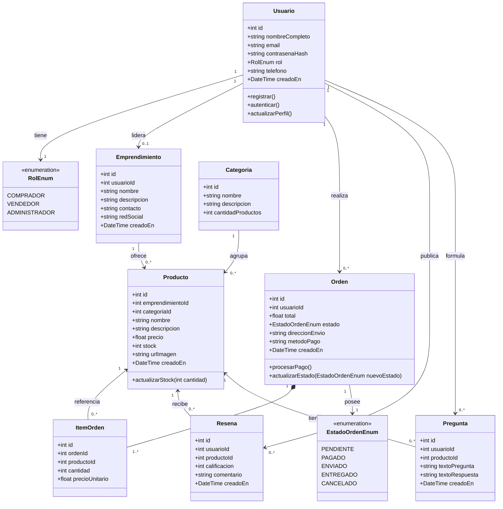
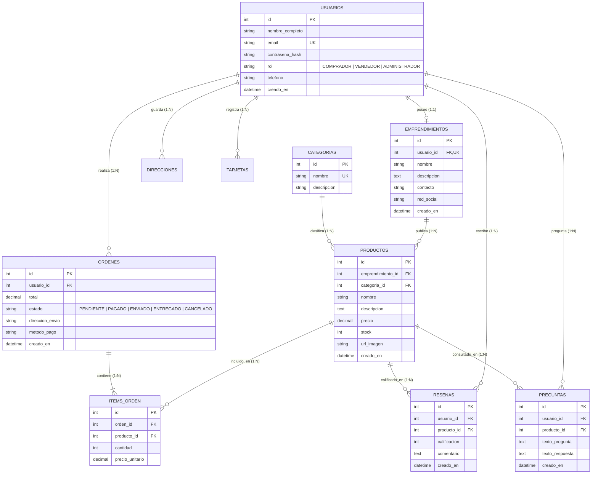
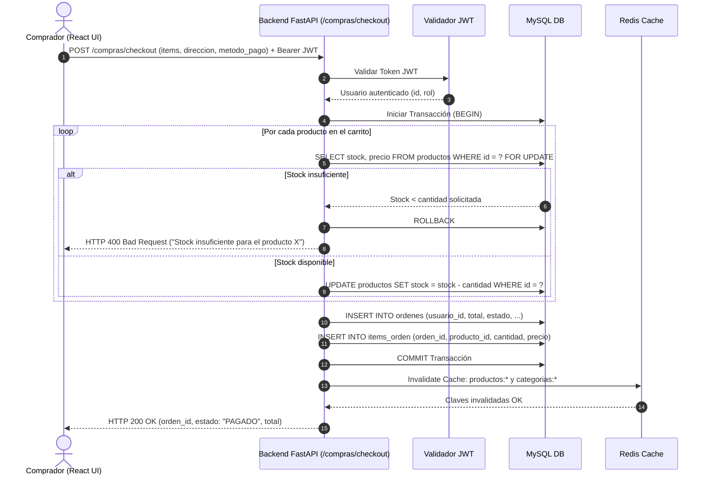
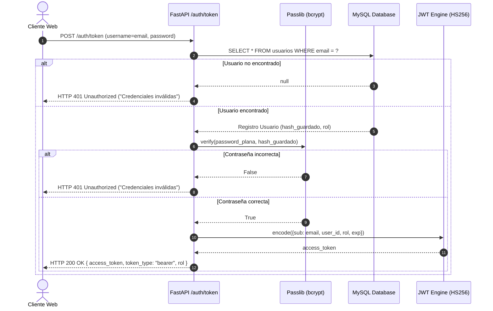
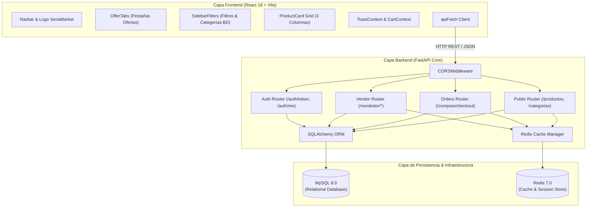
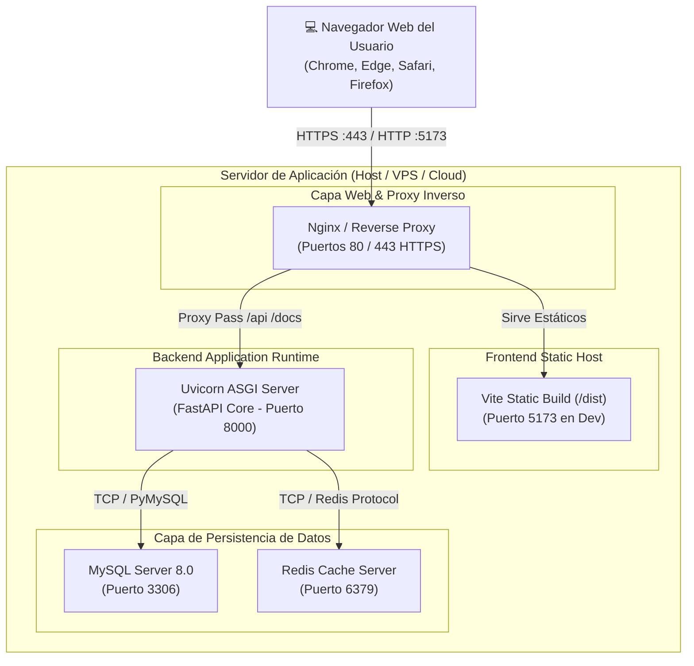
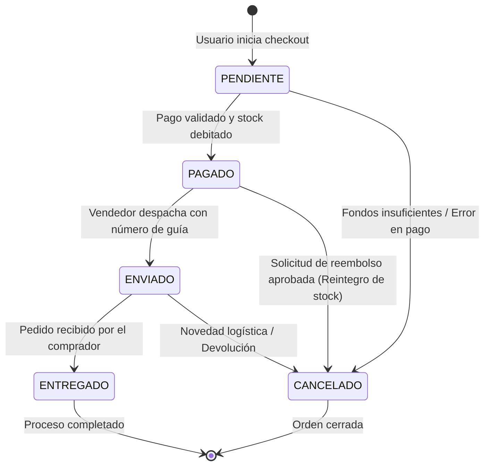
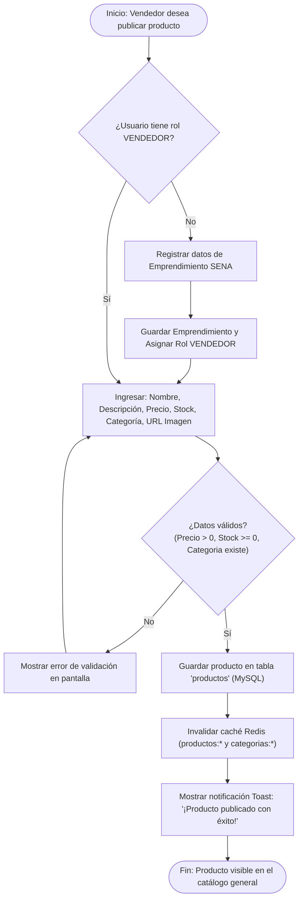

# Documentación de Arquitectura y Diagramas UML - SENAMARKET

Este documento especifica el diseño de software y la arquitectura del sistema **SenaMarket** (Plataforma E-Commerce para Emprendimientos del SENA) mediante **9 diagramas UML estándar**, expresados en sintaxis nativa de **Mermaid**.

---

## Índice de Diagramas UML

1. [Diagrama de Casos de Uso (Use Case Diagram)](#1-diagrama-de-casos-de-uso)
2. [Diagrama de Clases del Dominio (Class Diagram)](#2-diagrama-de-clases-del-dominio)
3. [Diagrama Entidad-Relación (ER Diagram / Modelo MySQL)](#3-diagrama-entidad-relación)
4. [Diagrama de Secuencia: Checkout y Procesamiento Atómico de Compra](#4-diagrama-de-secuencia-checkout-y-procesamiento-atómico-de-compra)
5. [Diagrama de Secuencia: Autenticación, JWT y Control de Roles](#5-diagrama-de-secuencia-autenticación-jwt-y-control-de-roles)
6. [Diagrama de Componentes del Sistema (Component Diagram)](#6-diagrama-de-componentes-del-sistema)
7. [Diagrama de Despliegue de Infraestructura (Deployment Diagram)](#7-diagrama-de-despliegue-de-infraestructura)
8. [Diagrama de Máquina de Estados: Ciclo de Vida de una Orden](#8-diagrama-de-máquina-de-estados-ciclo-de-vida-de-una-orden)
9. [Diagrama de Actividades: Publicación y Gestión de Catálogo por Vendedor](#9-diagrama-de-actividades-publicación-y-gestión-de-catálogo-por-vendedor)

---

## 1. Diagrama de Casos de Uso

Muestra las interacciones clave entre los actores del sistema (**Comprador**, **Vendedor**, **Administrador** y **Servicio de Notificaciones**) y los módulos funcionales de SenaMarket.

```mermaid
graph TD
    %% Actores
    Comprador((":bust_in_silhouette: Comprador"))
    Vendedor((":briefcase: Vendedor"))
    Admin((":shield: Administrador"))
    NotifSys((":bell: Sistema Notificaciones"))

    subgraph SENAMARKET ["Plataforma SenaMarket"]
        UC1["Registrarse / Iniciar Sesión"]
        UC2["Explorar Catálogo con Filtros y Categorías"]
        UC3["Gestionar Carrito Reactivo"]
        UC4["Realizar Checkout Atómico y Pago"]
        UC5["Hacer Pregunta / Dejar Calificación"]

        UC6["Registrar Emprendimiento SENA"]
        UC7["Gestionar Catálogo de Productos (CRUD)"]
        UC8["Visualizar y Despachar Pedidos"]
        UC9["Responder Preguntas de Compradores"]

        UC10["Gestionar Categorías y Conteos"]
        UC11["Supervisión de Usuarios y Roles"]
        UC12["Enviar Notificación de Pedido"]
    end

    %% Relaciones Comprador
    Comprador --> UC1
    Comprador --> UC2
    Comprador --> UC3
    Comprador --> UC4
    Comprador --> UC5

    %% Relaciones Vendedor
    Vendedor --> UC1
    Vendedor --> UC6
    Vendedor --> UC7
    Vendedor --> UC8
    Vendedor --> UC9

    %% Relaciones Administrador
    Admin --> UC1
    Admin --> UC10
    Admin --> UC11

    %% Includes & Extends
    UC4 ..> UC12 : <<include>>
    UC12 --> NotifSys
```

---

## 2. Diagrama de Clases del Dominio

Modela la estructura del backend de SenaMarket, sus atributos tipados, métodos y relaciones entre entidades del dominio.



---

## 3. Diagrama Entidad-Relación

Esquema físico relacional implementado en MySQL 8.0.



---

## 4. Diagrama de Secuencia: Checkout y Procesamiento Atómico de Compra

Representa la verificación de stock, débito atómico con rollback ante fallos, creación de la orden e invalidación de caché.



---

## 5. Diagrama de Secuencia: Autenticación, JWT y Control de Roles

Detalla el inicio de sesión, validación criptográfica de contraseñas y asignación del token de acceso con verificación de roles.



---

## 6. Diagrama de Componentes del Sistema

Ilustra la arquitectura por capas, la separación de responsabilidades y la integración entre el cliente web, la API REST y las capas de persistencia.



---

## 7. Diagrama de Despliegue de Infraestructura

Topología física de servidores, puertos y protocolos de comunicación del entorno de producción y desarrollo.



---

## 8. Diagrama de Máquina de Estados: Ciclo de Vida de una Orden

Modela las transiciones de estado de un pedido desde su creación hasta la entrega o cancelación.



---

## 9. Diagrama de Actividades: Publicación y Gestión de Catálogo por Vendedor

Flujo que describe el proceso de publicación de un nuevo producto, validación de campos, guardado en base de datos e invalidación de caché.


